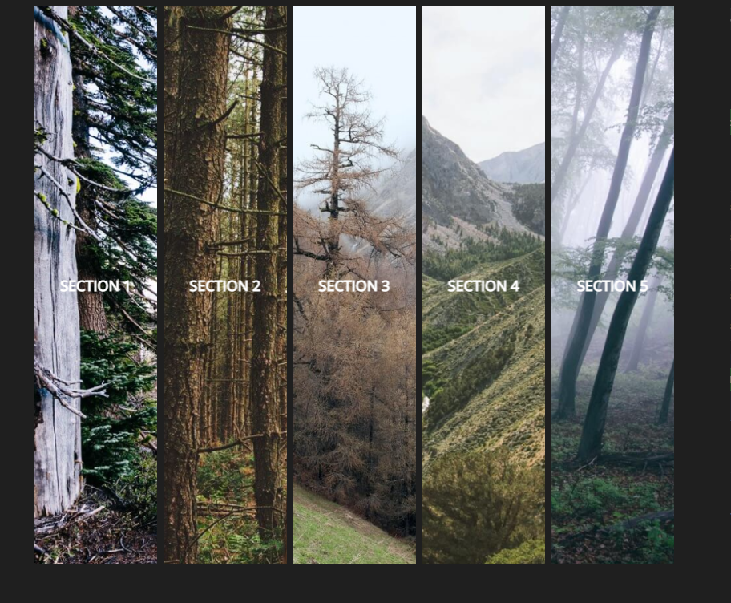

Chain Animation Project
---
This isn’t an entire website, but it could easily be. This template has a five-section layout with chainable animation. It’s great for showing off images.

- used it as an example for learning how to convert sass to css.
- conversion of sass code (scss) to css to run using modern browser
      run sass command in terminal to initiate

- the animation is complex in sass but very cool!
- could easily convert or add to this base project

Capture of main screen - doesn't show animations though

